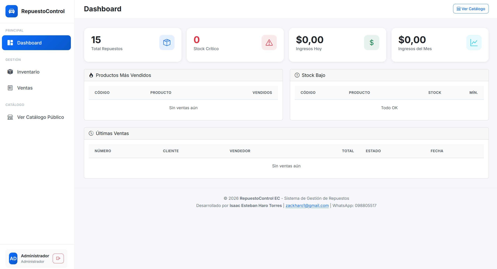

# RepuestoControl EC

Sistema de gestión e inventario profesional para tiendas de repuestos automotrices en Ecuador.

---

## 📸 Screenshots

### Login


### Dashboard


---

## 📋 Descripción

RepuestoControl EC es una aplicación web desarrollada con Django 5+ y PostgreSQL, diseñada para gestionar el inventario, ventas y métricas de tiendas de repuestos automotrices.

---

## 🏗️ Funcionalidades Principales

- **Gestión de Marcas** - CRUD completo de marcas compatibles
- **Gestión de Modelos** - Modelos relacionados con marcas
- **Gestión de Repuestos** - Código, nombre, precios, stock, ubicación
- **Inventario Inteligente** - Alertas de stock bajo, control de inventario
- **Módulo de Ventas** - Creación de ventas, control de stock, múltiples métodos de pago
- **Dashboard y Métricas** - Productos más vendidos, ingresos, stock crítico
- **Catálogo Público** - Vista pública sin login para clientes
- **Modo Oscuro/Claro** - Tema adaptativo
- **Diseño Responsivo** - Compatible con móviles y escritorio

---

## 🛠️ Stack Tecnológico

- Python 3.12
- Django 6.0
- PostgreSQL 17
- Bootstrap 5 (CDN)
- Docker
- HTML5 / CSS / JavaScript

---

## 🚀 Configuración con Docker

```bash
# Iniciar la aplicación
docker-compose up --build -d

# La aplicación estará disponible en:
# http://localhost:8000

# Panel de administración:
# http://localhost:8000/admin

# Catálogo público:
# http://localhost:8000/catalogo/
```

### Credenciales por defecto

- **Usuario:** admin
- **Contraseña:** admin123

---

## 📁 Estructura del Proyecto

```
Django-APP/
├── repuestocontrol/
│   ├── core/           # Usuarios y autenticación
│   ├── inventario/     # Gestión de repuestos
│   ├── ventas/         # Módulo de ventas
│   ├── dashboard/      # Métricas y estadísticas
│   ├── catalogo_publico/ # Catálogo público
│   ├── settings.py    # Configuración
│   └── urls.py        # Rutas principales
├── templates/         # Templates base
├── static/            # Archivos estáticos
├── docker-compose.yml # Docker compose
├── Dockerfile        # Imagen Docker
├── requirements.txt   # Dependencias
└── .env.example     # Variables de entorno
```

---

## 👨‍💻 Desarrollado por Isaac Esteban Haro Torres

**Ingeniero en Sistemas · Full Stack · Automatización · Data**

- 📧 Email: zackharo1@gmail.com
- 📱 WhatsApp: 098805517
- 💻 GitHub: https://github.com/ieharo1
- 🌐 Portafolio: https://ieharo1.github.io/portafolio-isaac.haro/

---

## 📄 Licencia

© 2026 Isaac Esteban Haro Torres - Todos los derechos reservados.
